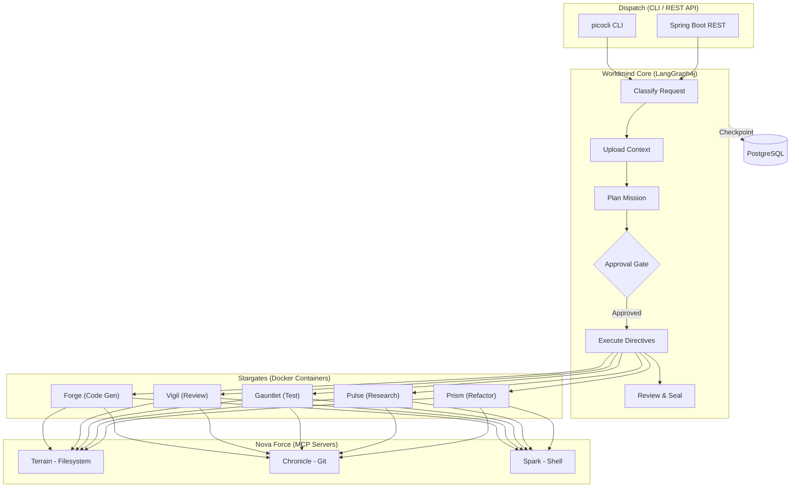

# Worldmind


An agentic code assistant that accepts natural language development requests and autonomously plans, implements, tests, and reviews code.

## About

Software development involves repetitive cycles of planning, coding, testing, and reviewing. Worldmind automates this entire pipeline by combining a deterministic orchestration layer with autonomous coding agents, enabling developers to describe what they want in plain English and receive production-ready, reviewed code.

Worldmind uses a hybrid architecture pairing [LangGraph4j](https://github.com/bsorrentino/langgraph4j) for orchestration with [Goose](https://github.com/block/goose) worker agents running in isolated Docker containers. The control plane classifies requests, scans project context, generates execution plans, and dispatches specialized agents — each with constrained permissions and clear success criteria.

The project uses Xandarian Worldmind / Nova Corps nomenclature from Marvel Comics throughout its architecture.

## Key Features

- **Natural language missions** — Submit development requests in plain English via CLI or REST API
- **Intelligent classification** — Automatically categorizes requests by complexity and determines execution strategy
- **Project-aware planning** — Scans your codebase to generate context-aware directives with success criteria
- **Specialized agents (Centurions)** — Purpose-built workers for code generation, review, testing, research, and refactoring
- **Sandboxed execution (Stargates)** — Each agent runs in an isolated Docker container with constrained permissions
- **Crash-resilient state** — PostgreSQL-backed checkpointing enables recovery and time-travel debugging
- **Flexible interaction modes** — Full auto, approve-plan, or step-by-step execution

## Architecture



## Built With

- [Java 21](https://openjdk.org/projects/jdk/21/) — Virtual threads for parallel agent execution
- [Spring Boot 3.4](https://spring.io/projects/spring-boot) — Application framework and REST API
- [Spring AI 1.0](https://spring.io/projects/spring-ai) — Anthropic Claude integration for LLM calls
- [LangGraph4j 1.8](https://github.com/bsorrentino/langgraph4j) — Stateful graph orchestration (Java port of LangGraph)
- [Goose](https://github.com/block/goose) — Autonomous coding agent (runs headless in containers)
- [picocli](https://picocli.info/) — CLI framework with ANSI colors and GraalVM support
- [Docker](https://www.docker.com/) — Container isolation for worker agents
- [PostgreSQL 16](https://www.postgresql.org/) — State checkpointing and persistence

## Getting Started

### Prerequisites

- Java 21+ ([download](https://adoptium.net/))
- Maven 3.9+ ([download](https://maven.apache.org/download.cgi))
- Docker and Docker Compose ([install guide](https://docs.docker.com/get-docker/))
- An Anthropic API key ([get one](https://console.anthropic.com/))

### Installation

1. Clone the repository
   ```bash
   git clone https://github.com/dbbaskette/Worldmind.git
   cd Worldmind
   ```

2. Start PostgreSQL
   ```bash
   docker compose up -d
   ```

3. Configure environment
   ```bash
   cp .env.example .env
   # Edit .env with your Anthropic API key
   ```

4. Build the project
   ```bash
   mvn clean package -DskipTests
   ```

5. Run Worldmind
   ```bash
   java -jar target/worldmind-0.1.0-SNAPSHOT.jar mission "Add input validation to the user registration endpoint"
   ```

## Usage

### Submit a Mission

```bash
# Full auto mode (default) — plans and executes without approval
worldmind mission "Add a REST endpoint for user search with pagination"

# Approve plan first — review the plan before execution begins
worldmind mission --mode APPROVE_PLAN "Refactor the payment service to use the strategy pattern"

# Step by step — approve each directive individually
worldmind mission --mode STEP_BY_STEP "Migrate the database schema to support multi-tenancy"
```

### Other Commands

```bash
worldmind status          # Show current mission status
worldmind health          # Check system health (DB, Docker, LLM)
worldmind history         # List past missions
```

## Environment Variables

| Variable | Description | Default | Required |
|----------|-------------|---------|----------|
| `ANTHROPIC_API_KEY` | Anthropic API key for Claude | - | Yes |
| `DATABASE_URL` | PostgreSQL connection string | `jdbc:postgresql://localhost:5432/worldmind` | No |
| `DB_USER` | Database username | `worldmind` | No |
| `DB_PASSWORD` | Database password | `worldmind` | No |
| `GOOSE_MODEL` | Model for Goose worker agents | `claude-sonnet-4-5-20250929` | No |

## Project Structure

```
src/main/java/com/worldmind/
├── WorldmindApplication.java          # Spring Boot entry point
├── core/
│   ├── engine/MissionEngine.java      # Orchestration bridge
│   ├── graph/WorldmindGraph.java      # LangGraph4j StateGraph definition
│   ├── llm/LlmService.java           # Spring AI ChatClient wrapper
│   ├── model/                         # Domain records (Classification, Directive, MissionPlan, ...)
│   ├── nodes/                         # Graph nodes (Classify, Upload, Plan)
│   ├── persistence/                   # JdbcCheckpointSaver for state persistence
│   ├── scanner/ProjectScanner.java    # Codebase analysis and context extraction
│   └── state/WorldmindState.java      # LangGraph4j AgentState definition
└── dispatch/cli/                      # picocli CLI commands (mission, status, health, history)
```

## Roadmap

- [x] Project scaffold (Maven, records, Docker Compose)
- [x] Planning pipeline (classify → upload → plan)
- [x] PostgreSQL checkpointing
- [x] CLI with mission submission
- [ ] First Centurion (Forge) in Docker with Goose
- [ ] Build-test-fix loop (Gauntlet, Vigil, seal evaluation)
- [ ] Parallel fan-out for independent directives
- [ ] REST API with SSE streaming and watch mode
- [ ] MCP auth, allowlists, metrics, and logging

## Contributing

1. Fork the repository
2. Create a feature branch (`git checkout -b feature/amazing-feature`)
3. Commit your changes (`git commit -m 'Add amazing feature'`)
4. Push to the branch (`git push origin feature/amazing-feature`)
5. Open a Pull Request

## License

Distributed under the MIT License. See [LICENSE](LICENSE) for details.

## Contact

Project Link: [https://github.com/dbbaskette/Worldmind](https://github.com/dbbaskette/Worldmind)
