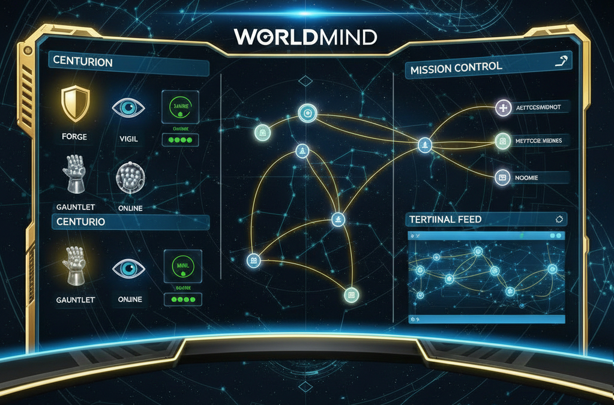

<p align="center">
  
</p>

<p align="center">
  
  
  
</p>

<p align="center">An agentic code assistant that accepts natural language development requests and autonomously plans, implements, tests, and reviews code.</p>

## About

Software development involves repetitive cycles of planning, coding, testing, and reviewing. Worldmind automates this entire pipeline by combining a deterministic orchestration layer with autonomous coding agents, enabling developers to describe what they want in plain English and receive production-ready, reviewed code.

Worldmind uses a hybrid architecture pairing [LangGraph4j](https://github.com/bsorrentino/langgraph4j) for orchestration with [Goose](https://github.com/block/goose) worker agents running in isolated Docker containers. The control plane classifies requests, scans project context, generates execution plans, and dispatches specialized agents — each with constrained permissions and clear success criteria.

The project uses Xandarian Worldmind / Nova Corps nomenclature from Marvel Comics throughout its architecture.

## Key Features

- **Natural language missions** — Submit development requests in plain English via CLI or REST API
- **Intelligent classification** — Automatically categorizes requests by complexity and determines execution strategy
- **Project-aware planning** — Scans your codebase to generate context-aware directives with success criteria
- **Specialized agents (Centurions)** — Purpose-built workers for code generation, review, testing, research, and refactoring
- **Sandboxed execution (Starblasters)** — Each agent runs in an isolated Docker container with constrained permissions
- **Crash-resilient state** — PostgreSQL-backed checkpointing enables recovery and time-travel debugging
- **Flexible interaction modes** — Full auto, approve-plan, or step-by-step execution
- **Real-time dashboard** — React web UI with SSE-powered live updates, plan approval, and event logs
- **REST API** — Full mission lifecycle via HTTP with SSE event streaming
- **Security hardening** — JWT authentication, command allowlists per centurion type, path restrictions
- **Observability** — Structured JSON logging, Prometheus metrics, component health checks
- **Cloud Foundry ready** — Deploy with `cf push` using git-based workspaces and CF task provider

## Architecture


## Built With

**Backend:**
- [Java 21](https://openjdk.org/projects/jdk/21/) — Virtual threads for parallel agent execution
- [Spring Boot 3.4](https://spring.io/projects/spring-boot) — Application framework and REST API
- [Spring AI 1.0](https://spring.io/projects/spring-ai) — Anthropic Claude integration for LLM calls
- [LangGraph4j 1.8](https://github.com/bsorrentino/langgraph4j) — Stateful graph orchestration (Java port of LangGraph)
- [Goose](https://github.com/block/goose) — Autonomous coding agent (runs headless in containers)
- [picocli](https://picocli.info/) — CLI framework with ANSI colors and GraalVM support
- [Docker](https://www.docker.com/) — Container isolation for worker agents
- [PostgreSQL 16](https://www.postgresql.org/) — State checkpointing and persistence

**Frontend:**
- [React 18](https://react.dev/) — UI framework with hooks and functional components
- [TypeScript](https://www.typescriptlang.org/) — Type-safe JavaScript
- [Vite](https://vite.dev/) — Fast build tool and dev server
- [Tailwind CSS](https://tailwindcss.com/) — Utility-first CSS framework

## Getting Started

### Prerequisites

- Java 21+ ([download](https://adoptium.net/))
- Maven 3.9+ ([download](https://maven.apache.org/download.cgi))
- Docker and Docker Compose ([install guide](https://docs.docker.com/get-docker/))
- An Anthropic API key ([get one](https://console.anthropic.com/))

### Installation

1. Clone the repository
   ```bash
   git clone https://github.com/dbbaskette/Worldmind.git
   cd Worldmind
   ```

2. Start PostgreSQL
   ```bash
   docker compose up -d
   ```

3. Configure environment
   ```bash
   cp .env.example .env
   # Edit .env with your Anthropic API key
   ```

4. Build the project
   ```bash
   mvn clean package -DskipTests
   ```

5. Run Worldmind
   ```bash
   java -jar target/worldmind-0.1.0-SNAPSHOT.jar mission "Add input validation to the user registration endpoint"
   ```

## Usage

### Submit a Mission

```bash
# Full auto mode (default) — plans and executes without approval
worldmind mission "Add a REST endpoint for user search with pagination"

# Approve plan first — review the plan before execution begins
worldmind mission --mode APPROVE_PLAN "Refactor the payment service to use the strategy pattern"

# Step by step — approve each directive individually
worldmind mission --mode STEP_BY_STEP "Migrate the database schema to support multi-tenancy"
```

### Web UI Dashboard

Access the real-time mission monitoring dashboard:

```bash
# Start the server in web mode
worldmind serve

# Or with Spring Boot directly
java -jar target/worldmind-0.1.0-SNAPSHOT.jar serve
```

Then navigate to `http://localhost:8080` in your browser.

**Features:**
- **Real-time monitoring** — Live directive status updates via SSE
- **Plan approval** — Review and approve/cancel plans before execution
- **Directive details** — View files affected, iterations, elapsed time
- **Event log** — Color-coded event stream with timestamps
- **Mission timeline** — Checkpoint history and state transitions

### Centurion Types

Worldmind uses five specialized Centurion agents, each with distinct capabilities:

**FORGE** — Code generation and implementation
```bash
worldmind mission "Add user authentication with JWT tokens"
```

**GAUNTLET** — Test writing and execution (auto-triggered after FORGE)
```bash
# Automatically runs tests after FORGE completes
```

**VIGIL** — Code review and quality assessment (auto-triggered after FORGE)
```bash
# Automatically reviews code after FORGE completes
```

**PULSE** — Read-only research and context gathering
```bash
worldmind mission "Analyze the security vulnerabilities in our authentication module"
```

**PRISM** — Code refactoring with behavioral equivalence verification
```bash
worldmind mission "Refactor the InstructionBuilder class to reduce code duplication while maintaining all tests"
```

### Other Commands

```bash
worldmind status          # Show current mission status
worldmind health          # Check system health (DB, Docker, LLM)
worldmind history         # List past missions
worldmind inspect <id>    # View detailed mission state
worldmind log             # View mission execution logs
worldmind timeline <id>   # Show checkpoint history for a mission
```

## Environment Variables

| Variable | Description | Default | Required |
|----------|-------------|---------|----------|
| `ANTHROPIC_API_KEY` | Anthropic API key for Claude | - | Yes |
| `DATABASE_URL` | PostgreSQL connection string | `jdbc:postgresql://localhost:5432/worldmind` | No |
| `DB_USER` | Database username | `worldmind` | No |
| `DB_PASSWORD` | Database password | `worldmind` | No |
| `GOOSE_MODEL` | Model for Goose worker agents | `claude-sonnet-4-5-20250929` | No |

## REST API

All endpoints are under `/api/v1`.

| Method | Endpoint | Description |
|--------|----------|-------------|
| `POST` | `/missions` | Submit a new mission (async) |
| `GET` | `/missions/{id}` | Get mission status and directives |
| `GET` | `/missions/{id}/events` | SSE stream of real-time events |
| `POST` | `/missions/{id}/approve` | Approve a planned mission |
| `POST` | `/missions/{id}/edit` | Submit plan modifications |
| `POST` | `/missions/{id}/cancel` | Cancel a running mission |
| `GET` | `/missions/{id}/timeline` | Checkpoint state history |
| `GET` | `/missions/{id}/directives/{did}` | Detailed directive result |
| `GET` | `/starblasters` | List active starblasters |
| `GET` | `/health` | Component health status |

## Project Structure

```
src/main/java/com/worldmind/
├── WorldmindApplication.java              # Spring Boot entry point
├── core/
│   ├── engine/MissionEngine.java          # Orchestration bridge to LangGraph4j
│   ├── events/                            # EventBus pub/sub and WorldmindEvent
│   ├── graph/WorldmindGraph.java          # LangGraph4j StateGraph definition
│   ├── health/                            # Component health checks (DB, Docker, LLM)
│   ├── llm/                               # Spring AI ChatClient wrapper
│   ├── logging/MdcContext.java            # SLF4J MDC context helper
│   ├── metrics/WorldmindMetrics.java      # Micrometer/Prometheus metrics
│   ├── model/                             # Domain records (16 records and enums)
│   ├── nodes/                             # Graph nodes (9 — Classify through Converge)
│   ├── persistence/                       # JdbcCheckpointSaver + CheckpointQueryService
│   ├── scanner/ProjectScanner.java        # Codebase analysis and context extraction
│   ├── scheduler/                         # Wave scheduling + oscillation detection
│   ├── seal/SealEvaluationService.java    # Quality gate (tests + review score)
│   ├── security/                          # JWT auth, command allowlists, path restrictions
│   └── state/WorldmindState.java          # LangGraph4j AgentState definition
├── dispatch/
│   ├── api/                               # REST controllers + SSE streaming
│   └── cli/                               # picocli commands (11 commands)
└── starblaster/
    ├── DockerStarblasterProvider.java         # Docker container lifecycle
    ├── InstructionBuilder.java            # Centurion instruction templating
    ├── StarblasterBridge.java                # Dispatch orchestration
    └── cf/                                # Cloud Foundry task provider

worldmind-ui/                              # React 18 + TypeScript + Vite + Tailwind
├── src/
│   ├── api/                               # REST client and SSE hooks
│   ├── components/                        # 9 React components (MissionForm, EventLog, ...)
│   ├── hooks/                             # useMission, useSse custom hooks
│   └── utils/                             # Constants and formatting helpers
└── dist/                                  # Production build output

docker/                                    # Centurion container images
├── centurion-base/                        # Shared base with Goose + entrypoint
├── centurion-forge/                       # Code generation
├── centurion-gauntlet/                    # Test execution
├── centurion-vigil/                       # Code review
├── centurion-pulse/                       # Research (read-only)
└── centurion-prism/                       # Refactoring
```

## Roadmap

- [x] Project scaffold (Maven, records, Docker Compose)
- [x] Planning pipeline (classify → upload → plan)
- [x] PostgreSQL checkpointing
- [x] CLI with mission submission
- [x] Centurions (Forge, Gauntlet, Vigil, Pulse, Prism) in Docker with Goose
- [x] Build-test-fix loop with Seal of Approval quality gate
- [x] Wave-based parallel fan-out with dependency-aware scheduling
- [x] REST API with SSE streaming and watch mode
- [x] Security hardening (JWT auth, command allowlists, path restrictions)
- [x] Structured logging, Prometheus metrics, health checks
- [x] React-based web UI dashboard with real-time monitoring
- [x] Cloud Foundry deployment support
- [ ] MCP server integration (Terrain, Chronicle, Spark)
- [ ] Multi-project workspace support
- [ ] GraalVM native image compilation

## Contributing

1. Fork the repository
2. Create a feature branch (`git checkout -b feature/amazing-feature`)
3. Commit your changes (`git commit -m 'Add amazing feature'`)
4. Push to the branch (`git push origin feature/amazing-feature`)
5. Open a Pull Request

## License

Distributed under the MIT License. See [LICENSE](LICENSE) for details.

## Contact

Project Link: [https://github.com/dbbaskette/Worldmind](https://github.com/dbbaskette/Worldmind)
