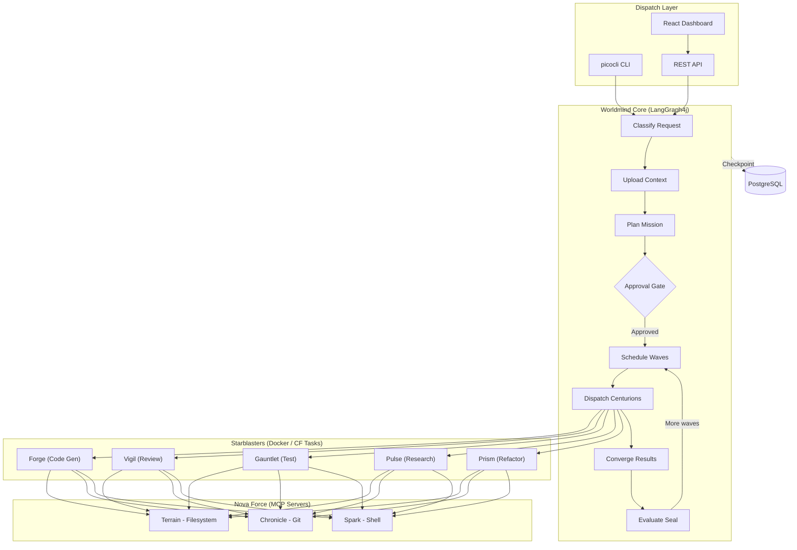

<p align="center">
  
</p>

<p align="center">
  
  
  
  
  
  
</p>

<p align="center">An agentic code assistant that accepts natural language development requests and autonomously plans, implements, tests, and reviews code.</p>

<p align="center">
  <a href="#getting-started">Getting Started</a> •
  <a href="#architecture">Architecture</a> •
  <a href="#usage">Usage</a> •
  <a href="docs/deployment/cloudfoundry.md">Cloud Foundry Guide</a>
</p>

## About

Software development involves repetitive cycles of planning, coding, testing, and reviewing. Worldmind automates this entire pipeline by combining a deterministic orchestration layer with autonomous coding agents, enabling developers to describe what they want in plain English and receive production-ready, reviewed code.

Worldmind uses a hybrid architecture pairing [LangGraph4j](https://github.com/bsorrentino/langgraph4j) for orchestration with [Goose](https://github.com/block/goose) worker agents running in isolated Docker containers. The control plane classifies requests, scans project context, generates execution plans, and dispatches specialized agents -- each with constrained permissions and clear success criteria.

The LLM layer supports multiple providers -- Anthropic Claude, OpenAI-compatible endpoints (LM Studio, Ollama), and Google Gemini -- configurable per deployment via Spring AI.

The project uses Xandarian Worldmind / Nova Corps nomenclature from Marvel Comics throughout its architecture.

## Key Features

- **Natural language missions** -- Submit development requests in plain English via CLI, REST API, or web dashboard
- **Intelligent classification** -- Automatically categorizes requests by complexity and determines execution strategy
- **Project-aware planning** -- Scans your codebase to generate context-aware directives with success criteria
- **Specialized agents (Centurions)** -- Purpose-built workers for code generation, review, testing, research, and refactoring
- **Sandboxed execution (Starblasters)** -- Each agent runs in an isolated Docker container with constrained permissions and runtime-specific toolchains
- **Runtime resolution** -- Automatically selects language-specific Docker images (Java, Python, Node) based on request classification, with base-image fallback
- **Wave-based parallelism** -- Dependency-aware scheduling dispatches independent directives concurrently
- **Crash-resilient state** -- PostgreSQL-backed checkpointing enables recovery and time-travel debugging
- **Flexible interaction modes** -- Full auto, approve-plan, or step-by-step execution
- **Real-time dashboard** -- React web UI with SSE-powered live updates, plan approval, and event logs
- **REST API** -- Full mission lifecycle via HTTP with SSE event streaming
- **Security hardening** -- JWT authentication, command allowlists per centurion type, path restrictions
- **Observability** -- Structured JSON logging, Prometheus metrics, component health checks
- **Cloud Foundry ready** -- Deploy with `./run.sh --cf` using git-based workspaces, java-cfenv service auto-binding, and CF task provider

## Architecture



## Built With

**Backend:**
- [Java 21](https://openjdk.org/projects/jdk/21/) -- Virtual threads for parallel agent execution
- [Spring Boot 3.4](https://spring.io/projects/spring-boot) -- Application framework and REST API
- [Spring AI 1.1](https://spring.io/projects/spring-ai) -- Multi-provider LLM integration (Anthropic, OpenAI, Google Gemini)
- [LangGraph4j 1.8](https://github.com/bsorrentino/langgraph4j) -- Stateful graph orchestration (Java port of LangGraph)
- [Goose](https://github.com/block/goose) -- Autonomous coding agent (runs headless in containers)
- [picocli](https://picocli.info/) -- CLI framework with ANSI colors and GraalVM support
- [Docker](https://www.docker.com/) -- Container isolation for worker agents
- [PostgreSQL 16](https://www.postgresql.org/) -- State checkpointing and persistence

**Frontend:**
- [React 18](https://react.dev/) -- UI framework with hooks and functional components
- [TypeScript](https://www.typescriptlang.org/) -- Type-safe JavaScript
- [Vite](https://vite.dev/) -- Fast build tool and dev server
- [Tailwind CSS](https://tailwindcss.com/) -- Utility-first CSS framework

## Getting Started

### Prerequisites

- Java 21+ ([download](https://adoptium.net/))
- Maven 3.9+ ([download](https://maven.apache.org/download.cgi))
- Docker and Docker Compose ([install guide](https://docs.docker.com/get-docker/))
- An LLM API key (Anthropic, OpenAI-compatible, or Google Gemini)

### Installation

1. Clone the repository
   ```bash
   git clone https://github.com/dbbaskette/Worldmind.git
   cd Worldmind
   ```

2. Configure environment
   ```bash
   cp .env.example .env
   # Edit .env with your API key and preferences
   ```

3. Start everything with Docker
   ```bash
   ./run.sh --docker
   ```

   Or start just PostgreSQL and run locally:
   ```bash
   docker compose up -d postgres
   ./run.sh serve
   ```

4. Open the dashboard at `http://localhost:8080`

### Quick Start (CLI)

```bash
# Submit a mission in full-auto mode
./run.sh mission "Add input validation to the user registration endpoint"

# Review plan before execution
./run.sh mission --mode APPROVE_PLAN "Refactor the payment service to use the strategy pattern"
```

## Usage

### Submit a Mission

```bash
# Full auto mode -- plans and executes without approval
./run.sh mission "Add a REST endpoint for user search with pagination"

# Approve plan first -- review the plan before execution begins
./run.sh mission --mode APPROVE_PLAN "Refactor the payment service to use the strategy pattern"

# Step by step -- approve each directive individually
./run.sh mission --mode STEP_BY_STEP "Migrate the database schema to support multi-tenancy"
```

### Web UI Dashboard

```bash
./run.sh serve
```

Navigate to `http://localhost:8080` in your browser.

**Features:**
- **Real-time monitoring** -- Live directive status updates via SSE
- **Plan approval** -- Review and approve/cancel plans before execution
- **Directive details** -- View files affected, iterations, elapsed time
- **Event log** -- Color-coded event stream with timestamps
- **Mission timeline** -- Checkpoint history and state transitions

### Centurion Types

Worldmind uses five specialized Centurion agents, each with distinct capabilities:

| Centurion | Role | Permissions |
|-----------|------|-------------|
| **Forge** | Code generation and implementation | Read/write `src/`, `lib/`, `app/` |
| **Gauntlet** | Test writing and execution | Read/write `test/`, `tests/`, `spec/` |
| **Vigil** | Code review and quality assessment | Read-only |
| **Pulse** | Research and context gathering | Read-only |
| **Prism** | Refactoring with behavioral equivalence | Read/write `src/`, `lib/`, `app/` |

### Other Commands

```bash
./run.sh serve               # Start HTTP server + React dashboard
./run.sh status              # Show current mission status
./run.sh health              # Check system health (DB, Docker, LLM)
./run.sh history             # List past missions
./run.sh inspect <id>        # View detailed mission state
./run.sh log                 # View mission execution logs
./run.sh timeline <id>       # Show checkpoint history for a mission
./run.sh --docker            # Start everything in Docker
./run.sh --down              # Stop all Docker services
./run.sh --cf                # Build and push to Cloud Foundry
```

## Environment Variables

| Variable | Description | Default | Required |
|----------|-------------|---------|----------|
| `ANTHROPIC_API_KEY` | Anthropic API key for Claude | -- | Yes (if using Anthropic) |
| `DATABASE_URL` | PostgreSQL connection string | `jdbc:postgresql://localhost:5432/worldmind` | No |
| `DB_USER` | Database username | `worldmind` | No |
| `DB_PASSWORD` | Database password | `worldmind` | No |
| `GOOSE_MODEL` | Model for Goose worker agents | `qwen2.5-coder-32b` | No |
| `GOOSE_PROVIDER` | LLM provider (`openai`, `anthropic`) | `openai` | No |
| `LM_STUDIO_URL` | OpenAI-compatible endpoint URL | `http://host.docker.internal:1234/v1` | No |
| `CENTURION_IMAGE_REGISTRY` | Docker image registry for centurions | `ghcr.io/dbbaskette` | No |
| `STARBLASTER_IMAGE_PREFIX` | Image name prefix for starblaster images | `starblaster` | No |
| `STARBLASTER_PROVIDER` | Container provider (`docker`, `cloudfoundry`) | `docker` | No |
| `WORLDMIND_PROFILE` | Spring profile | `local` | No |
| `WORLDMIND_PORT` | Server port | `8080` | No |

## REST API

All endpoints are under `/api/v1`.

| Method | Endpoint | Description |
|--------|----------|-------------|
| `POST` | `/missions` | Submit a new mission (async) |
| `GET` | `/missions` | List all tracked missions |
| `GET` | `/missions/{id}` | Get mission status and directives |
| `GET` | `/missions/{id}/events` | SSE stream of real-time events |
| `POST` | `/missions/{id}/approve` | Approve a planned mission |
| `POST` | `/missions/{id}/edit` | Submit plan modifications |
| `POST` | `/missions/{id}/cancel` | Cancel a running mission |
| `POST` | `/missions/{id}/retry` | Retry failed directives |
| `GET` | `/missions/{id}/timeline` | Checkpoint state history |
| `GET` | `/missions/{id}/directives/{did}` | Detailed directive result |
| `GET` | `/starblasters` | List active starblasters |
| `GET` | `/health` | Component health status |
| `GET` | `/settings` | Get current settings |
| `PUT` | `/settings` | Update settings |

### Example: Submit a Mission

```bash
curl -X POST http://localhost:8080/api/v1/missions \
  -H 'Content-Type: application/json' \
  -d '{
    "request": "Add input validation to the user registration endpoint",
    "mode": "APPROVE_PLAN",
    "project_path": "/path/to/project",
    "git_remote_url": "https://github.com/org/repo.git"
  }'
```

## Docker

### Development Mode

```bash
# Start all services (PostgreSQL + Worldmind)
./run.sh --docker

# Start just PostgreSQL
docker compose up -d postgres

# Stop everything
./run.sh --down
```

### Docker Images

Docker images are located in `docker/`:

```
docker/
├── centurion-base/        # Shared base with Goose + entrypoint
├── centurion-forge/       # Code generation
├── centurion-gauntlet/    # Test execution
├── centurion-vigil/       # Code review
├── centurion-pulse/       # Research (read-only)
├── centurion-prism/       # Refactoring
└── starblasters/          # Runtime-tagged images
    ├── Dockerfile.base    # Base image (Goose + git + shell)
    ├── Dockerfile.java    # JDK 21 + Maven + Gradle
    ├── Dockerfile.python  # Python 3.12 + pip + uv
    ├── entrypoint.sh      # Shared container entrypoint
    └── build-all.sh       # Local build script
```

**Runtime resolution:** Worldmind classifies each request to determine the target language and selects the matching tagged image (e.g., `starblaster:java`). If the tagged image isn't available, it falls back to `starblaster:base` where Goose installs the required toolchain at runtime.

## Cloud Foundry Deployment

Worldmind supports Cloud Foundry deployment using CF tasks and git-based workspace coordination.

```bash
./run.sh --cf
```

**Required services:**
- `worldmind-postgres` -- PostgreSQL (auto-bound via java-cfenv)
- `worldmind-model` -- OpenAI-compatible LLM (auto-bound via CfModelServiceProcessor)

On CF, centurions share work through git branches instead of Docker volumes. The orchestrator creates a mission branch, centurions clone and push changes, and results are merged on completion.

See [docs/deployment/cloudfoundry.md](docs/deployment/cloudfoundry.md) for the full deployment guide.

## Project Structure

```
src/main/java/com/worldmind/
├── WorldmindApplication.java              # Spring Boot entry point
├── core/
│   ├── engine/MissionEngine.java          # Orchestration bridge to LangGraph4j
│   ├── events/                            # EventBus pub/sub and WorldmindEvent
│   ├── graph/WorldmindGraph.java          # LangGraph4j StateGraph definition
│   ├── health/                            # Component health checks (DB, Docker, LLM)
│   ├── llm/                               # Spring AI ChatClient wrapper
│   ├── logging/MdcContext.java            # SLF4J MDC context helper
│   ├── metrics/WorldmindMetrics.java      # Micrometer/Prometheus metrics
│   ├── model/                             # Domain records (16 records and enums)
│   ├── nodes/                             # Graph nodes (classify, plan, dispatch, seal...)
│   ├── persistence/                       # JdbcCheckpointSaver + CheckpointQueryService
│   ├── scanner/ProjectScanner.java        # Codebase analysis and context extraction
│   ├── scheduler/                         # Wave scheduling + oscillation detection
│   ├── seal/SealEvaluationService.java    # Quality gate (tests + review score)
│   ├── security/                          # JWT auth, command allowlists, path restrictions
│   └── state/WorldmindState.java          # LangGraph4j AgentState definition
├── dispatch/
│   ├── api/                               # REST controllers + SSE streaming
│   └── cli/                               # picocli commands (11 commands)
└── starblaster/
    ├── DockerStarblasterProvider.java     # Docker container lifecycle
    ├── InstructionBuilder.java            # Centurion instruction templating
    ├── StarblasterBridge.java             # Dispatch orchestration
    └── cf/                                # Cloud Foundry task provider + java-cfenv

worldmind-ui/                              # React 18 + TypeScript + Vite + Tailwind
├── src/
│   ├── api/                               # REST client and SSE hooks
│   ├── components/                        # 9 React components
│   ├── hooks/                             # useMission, useSse custom hooks
│   └── utils/                             # Constants and formatting helpers
└── dist/                                  # Production build output
```

## Roadmap

- [x] Project scaffold (Maven, records, Docker Compose)
- [x] Planning pipeline (classify, upload context, plan)
- [x] PostgreSQL checkpointing with time-travel debugging
- [x] CLI with mission submission and management
- [x] Centurions (Forge, Gauntlet, Vigil, Pulse, Prism) in Docker with Goose
- [x] Build-test-fix loop with Seal of Approval quality gate
- [x] Wave-based parallel fan-out with dependency-aware scheduling
- [x] REST API with SSE streaming
- [x] Security hardening (JWT auth, command allowlists, path restrictions)
- [x] Structured logging, Prometheus metrics, health checks
- [x] React web UI dashboard with real-time monitoring
- [x] Cloud Foundry deployment with java-cfenv and git workspaces
- [x] Multi-provider LLM support (Anthropic, OpenAI, Google Gemini)
- [x] Runtime-tagged Starblaster images with automatic language detection and base fallback
- [x] SSE heartbeat for CF gorouter keep-alive
- [x] GitHub Actions CI for centurion image builds
- [ ] MCP server integration (Terrain, Chronicle, Spark)
- [ ] Multi-project workspace support
- [ ] GraalVM native image compilation

## Contributing

1. Fork the repository
2. Create a feature branch (`git checkout -b feature/amazing-feature`)
3. Commit your changes (`git commit -m 'Add amazing feature'`)
4. Push to the branch (`git push origin feature/amazing-feature`)
5. Open a Pull Request

## License

Distributed under the MIT License. See [LICENSE](LICENSE) for details.

## Contact

Project Link: [https://github.com/dbbaskette/Worldmind](https://github.com/dbbaskette/Worldmind)
