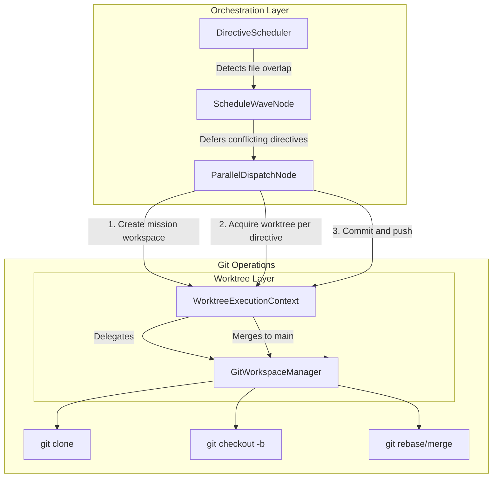
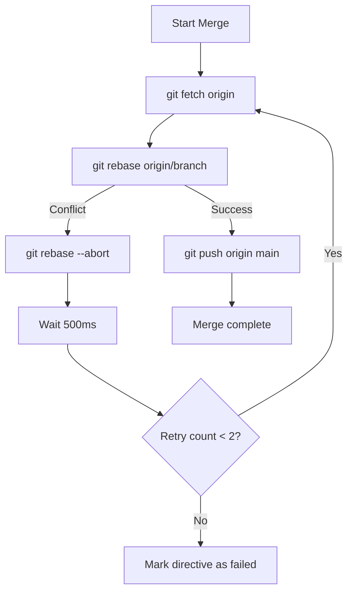

# Git Worktrees Architecture

This document explains how Worldmind uses git worktrees to enable parallel directive execution without merge conflicts.

## Overview

When Worldmind executes multiple directives in parallel, each directive may modify files in the same repository. Without isolation, concurrent file modifications would cause conflicts and race conditions. Git worktrees solve this by giving each directive its own isolated working directory while sharing the same git history.

### Why Worktrees?

| Approach | Pros | Cons |
|----------|------|------|
| Single working directory | Simple | No parallel execution possible |
| Multiple clones | Full isolation | Expensive (duplicated .git directory) |
| **Git worktrees** | Shared .git, independent working directories | Best of both worlds |

A git worktree is a linked working tree attached to a repository. Multiple worktrees share the same `.git` directory but have completely independent file systems. Each worktree can be on a different branch, enabling true parallel development.

## Architecture

### Mission Workspace Structure

When a mission starts, Worldmind creates a mission workspace that serves as the shared git repository:

```
/tmp/worldmind/
└── mission-{missionId}/
    ├── .git/                    # Shared git directory
    ├── worktrees/
    │   ├── directive-abc/       # Isolated working directory
    │   │   ├── src/
    │   │   └── ...
    │   ├── directive-def/       # Another isolated directory
    │   │   ├── src/
    │   │   └── ...
    │   └── directive-ghi/
    │       ├── src/
    │       └── ...
    └── main/                    # Main worktree (bare clone target)
```

### Component Responsibilities



| Component | Responsibility |
|-----------|----------------|
| `DirectiveScheduler` | Detects file overlap between directives, defers conflicting ones |
| `ScheduleWaveNode` | Computes next wave respecting file conflicts |
| `ParallelDispatchNode` | Dispatches directives in parallel using worktrees |
| `WorktreeExecutionContext` | Manages worktree lifecycle (create, acquire, release, cleanup) |
| `GitWorkspaceManager` | Low-level git operations (clone, worktree, merge) |

## Execution Flow

### 1. Mission Initialization

When the first wave starts:

```java
// ParallelDispatchNode.apply()
if (worktreesEnabled && state.waveCount() == 1) {
    worktreeContext.createMissionWorkspace(missionId, gitUrl);
}
```

This clones the repository to create the shared `.git` directory.

### 2. Directive Execution

For each directive in a wave:

```java
// ParallelDispatchNode - per directive
Path worktreePath = worktreeContext.acquireWorktree(missionId, directiveId, "main");
// worktreePath is now an isolated directory with its own branch
```

The directive executes with `worktreePath` as its project path. All file modifications happen in this isolated directory.

### 3. Commit and Push

After successful directive completion:

```java
worktreeContext.commitAndPush(directiveId);
// Creates commit on directive-specific branch and pushes to remote
```

### 4. Wave Completion and Merge

After all directives in a wave complete, branches are merged back to `main`:

```java
// Merge flow
git checkout main
git fetch origin
git rebase origin/directive-abc
git push origin main
```

### 5. Cleanup

When the mission completes:

```java
worktreeContext.cleanupMission(missionId);
// Removes all worktrees and the mission workspace
```

## Merge Strategy

### Rebase-First with Retry

Worldmind uses a rebase-first strategy with automatic retry for merge conflicts:



### Why Rebase?

1. **Linear history** -- Easier to understand and debug
2. **Cleaner merges** -- Avoids merge commits for simple changes
3. **Conflict detection** -- Fails fast on semantic conflicts

### Retry Logic

When a merge conflict occurs:

1. Abort the current rebase
2. Wait 500ms (mitigates race conditions)
3. Fetch latest `main`
4. Retry the rebase
5. If still failing after 2 retries, mark directive as failed

## File Overlap Detection

Before executing directives in parallel, `DirectiveScheduler` checks for file overlap:

```java
// DirectiveScheduler.computeNextWave()
Set<String> usedFiles = new HashSet<>();
for (Directive candidate : pending) {
    Set<String> targetFiles = candidate.targetFiles();
    if (hasOverlap(usedFiles, targetFiles)) {
        deferred.add(candidate);
        continue;
    }
    usedFiles.addAll(targetFiles);
    eligible.add(candidate);
}
```

### Path Normalization

File paths are normalized to handle variations:

| Input Path | Normalized |
|------------|------------|
| `./src/Main.java` | `src/Main.java` |
| `/full/path/src/Main.java` | `src/Main.java` (suffix match) |
| `src/Main.java` | `src/Main.java` |

### Conflict Resolution

When overlap is detected:

1. First directive gets the files
2. Conflicting directives are deferred to the next wave
3. Deferred directives execute after the first completes and merges

## Configuration

### Enabling Worktrees

```yaml
worldmind:
  starblaster:
    worktrees-enabled: true    # Enable worktree isolation
```

### Related Properties

```yaml
worldmind:
  starblaster:
    max-parallel: 4           # Max concurrent directives
    wave-cooldown-seconds: 5  # Delay between waves
```

## Metrics

The following metrics are recorded for monitoring:

| Metric | Type | Description |
|--------|------|-------------|
| `worldmind.parallel.worktree_operations` | Counter | Worktree acquire/release/cleanup by success |
| `worldmind.parallel.active_worktrees` | Gauge | Active worktrees at wave execution |
| `worldmind.parallel.file_overlap_deferrals` | Counter | Directives deferred due to file conflicts |
| `worldmind.parallel.merge_conflicts` | Counter | Merge conflicts by resolution status |
| `worldmind.parallel.merge_retry_success` | Counter | Successful merge retries |

## Limitations

### Current Limitations

1. **Local execution only** -- Worktrees require filesystem access; CF Tasks use git branches directly
2. **Branch namespace** -- Each directive creates a branch; many directives = many branches
3. **Merge order** -- Merges happen in completion order, not directive order

### Future Improvements

1. Configurable merge strategy (rebase vs merge commit)
2. Branch cleanup policies
3. Worktree pooling for frequently used repositories

## Related Documentation

- [Troubleshooting: Merge Conflicts](../troubleshooting/merge-conflicts.md)
- [Configuration: Parallel Execution](../configuration/parallel-execution.md)
- [Deployment: Cloud Foundry](../deployment/cloudfoundry.md)
