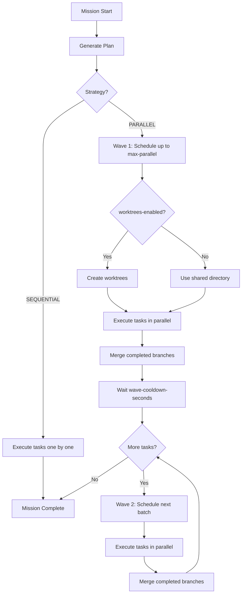

# Configuration: Parallel Execution

This guide covers configuration options for parallel task execution in Worldmind.

## Execution Strategy Selection

### SEQUENTIAL vs PARALLEL

| Strategy | Description | Use Case |
|----------|-------------|----------|
| `SEQUENTIAL` | One task at a time | New projects, high-risk changes, interdependent work |
| `PARALLEL` | Multiple tasks concurrently | Mature codebases, independent features, performance |

### How Strategy is Determined

1. **Manual selection** -- Specify `--strategy SEQUENTIAL` in CLI or API
2. **LLM planner** -- The `PlanMissionNode` analyzes the request and codebase
3. **Default** -- New projects default to `SEQUENTIAL` per planner guidance

### Strategy Selection Guidelines

```
┌─────────────────────────────────────────────────────────────┐
│                    Choose Execution Strategy                │
├─────────────────────────────────────────────────────────────┤
│                                                             │
│  Is this a new project or major structural change?          │
│  ├─ YES → Use SEQUENTIAL                                    │
│  └─ NO ↓                                                    │
│                                                             │
│  Do the tasks modify shared files?                     │
│  ├─ YES → Use SEQUENTIAL                                    │
│  └─ NO ↓                                                    │
│                                                             │
│  Are the changes independent features?                      │
│  ├─ YES → Use PARALLEL                                      │
│  └─ NO ↓                                                    │
│                                                             │
│  When in doubt → Use SEQUENTIAL                             │
│                                                             │
└─────────────────────────────────────────────────────────────┘
```

## Configuration Properties

### Core Parallel Execution Settings

```yaml
worldmind:
  sandbox:
    # Enable git worktree isolation for parallel execution
    # When false, tasks share a single working directory
    worktrees-enabled: true

    # Maximum number of tasks executing concurrently
    # Higher values = more parallelism, more resource usage
    max-parallel: 4

    # Seconds to wait between waves
    # Helps prevent merge race conditions
    wave-cooldown-seconds: 5

    # Container provider (docker or cloudfoundry)
    provider: docker
```

### Property Reference

| Property | Type | Default | Description |
|----------|------|---------|-------------|
| `worldmind.sandbox.worktrees-enabled` | boolean | `false` | Enable worktree-based isolation |
| `worldmind.sandbox.max-parallel` | int | `4` | Maximum concurrent tasks |
| `worldmind.sandbox.wave-cooldown-seconds` | int | `5` | Delay between waves |
| `worldmind.sandbox.provider` | string | `docker` | Container provider |

### Environment Variables

Properties can also be set via environment variables:

```bash
export WORLDMIND_SANDBOX_WORKTREES_ENABLED=true
export WORLDMIND_SANDBOX_MAX_PARALLEL=4
export WORLDMIND_SANDBOX_WAVE_COOLDOWN_SECONDS=5
```

## Tuning Parameters

### max-parallel

Controls how many tasks can execute simultaneously in a single wave.

**Considerations:**
- Higher values increase throughput but require more resources (CPU, memory, disk I/O)
- Each parallel task needs its own container and worktree
- Network bandwidth to LLM providers may become a bottleneck

**Recommendations:**

| Environment | Recommended `max-parallel` |
|-------------|---------------------------|
| Development laptop | 2-4 |
| CI/CD server | 4-8 |
| Production (dedicated) | 8-16 |
| Resource-constrained | 1-2 |

### wave-cooldown-seconds

Delay between completing one wave and starting the next.

**Purpose:**
- Allows merge operations to complete
- Reduces race conditions
- Gives git push operations time to propagate

**Recommendations:**

| Scenario | Recommended Value |
|----------|-------------------|
| Local development | 2-5 seconds |
| Remote git (GitHub/GitLab) | 5-10 seconds |
| High-latency network | 10-15 seconds |
| Frequent merge conflicts | 10-15 seconds |

### worktrees-enabled

Enables git worktree isolation for parallel execution.

**When to enable:**
- Running with `PARALLEL` strategy
- Using Docker provider (local execution)
- Need true file isolation between tasks

**When to disable:**
- Using Cloud Foundry provider (uses git branches instead)
- Running with `SEQUENTIAL` strategy (no parallel execution)
- Debugging worktree-related issues

## Execution Flow with Parallel Settings



## Provider-Specific Configuration

### Docker Provider

```yaml
worldmind:
  sandbox:
    provider: docker
    worktrees-enabled: true      # Recommended for Docker
    image-registry: ghcr.io/dbbaskette
    image-prefix: sandbox
```

Docker provider runs agents in local containers with filesystem access. Worktrees provide true isolation.

### Cloud Foundry Provider

```yaml
worldmind:
  sandbox:
    provider: cloudfoundry
    worktrees-enabled: false     # CF uses git branches instead
```

CF provider runs agents as CF tasks. Each task clones the repository and pushes to its own branch. Worktrees are not used because tasks don't share filesystem.

## Monitoring Parallel Execution

### Key Metrics

| Metric | What to Watch |
|--------|---------------|
| `worldmind_wave_executions_total` | Total waves executed by strategy |
| `worldmind_wave_task_count` | Tasks per wave (should match `max-parallel`) |
| `worldmind_parallel_active_worktrees` | Should not exceed `max-parallel` |
| `worldmind_parallel_file_overlap_deferrals_total` | High values = too much overlap |
| `worldmind_parallel_merge_conflicts_total` | High unresolved = tune settings |

### Prometheus Queries

```promql
# Average tasks per wave
avg(worldmind_wave_task_count)

# Percentage of tasks deferred due to overlap
sum(rate(worldmind_parallel_file_overlap_deferrals_total[5m])) /
sum(rate(worldmind_task_dispatched_total[5m])) * 100

# Merge conflict resolution rate
sum(worldmind_parallel_merge_conflicts_total{resolved="true"}) /
sum(worldmind_parallel_merge_conflicts_total) * 100
```

### Grafana Dashboard Suggestions

1. **Wave Throughput** -- Waves per minute by strategy
2. **Parallel Utilization** -- Active worktrees vs max-parallel
3. **Conflict Rate** -- Deferrals and merge conflicts over time
4. **Mission Duration** -- Compare SEQUENTIAL vs PARALLEL execution time

## Troubleshooting Configuration Issues

### Symptoms and Solutions

| Symptom | Likely Cause | Solution |
|---------|--------------|----------|
| Tasks execute sequentially despite PARALLEL | `worktrees-enabled: false` or file overlap | Enable worktrees or reduce overlap |
| OOM errors during parallel execution | `max-parallel` too high | Reduce `max-parallel` |
| Frequent merge conflicts | `wave-cooldown-seconds` too low | Increase cooldown |
| Tasks stuck waiting | File overlap detection | Review plan for overlapping `targetFiles` |
| Slow wave startup | Container pull time | Pre-pull images or use local registry |

### Debug Logging

Enable debug logging for parallel execution:

```yaml
logging:
  level:
    com.worldmind.core.scheduler: DEBUG
    com.worldmind.core.nodes.ParallelDispatchNode: DEBUG
    com.worldmind.sandbox.WorktreeExecutionContext: DEBUG
    com.worldmind.sandbox.cf.GitWorkspaceManager: DEBUG
```

## Example Configurations

### Conservative (Stability-focused)

```yaml
worldmind:
  sandbox:
    worktrees-enabled: true
    max-parallel: 2
    wave-cooldown-seconds: 10
```

### Aggressive (Performance-focused)

```yaml
worldmind:
  sandbox:
    worktrees-enabled: true
    max-parallel: 8
    wave-cooldown-seconds: 2
```

### CI/CD Pipeline

```yaml
worldmind:
  sandbox:
    worktrees-enabled: true
    max-parallel: 4
    wave-cooldown-seconds: 5
    provider: docker
```

### Cloud Foundry Production

```yaml
worldmind:
  sandbox:
    worktrees-enabled: false
    max-parallel: 4
    wave-cooldown-seconds: 10
    provider: cloudfoundry
```

## Related Documentation

- [Architecture: Git Worktrees](../architecture/git-worktrees.md)
- [Troubleshooting: Merge Conflicts](../troubleshooting/merge-conflicts.md)
- [Deployment: Cloud Foundry](../deployment/cloudfoundry.md)
